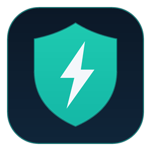
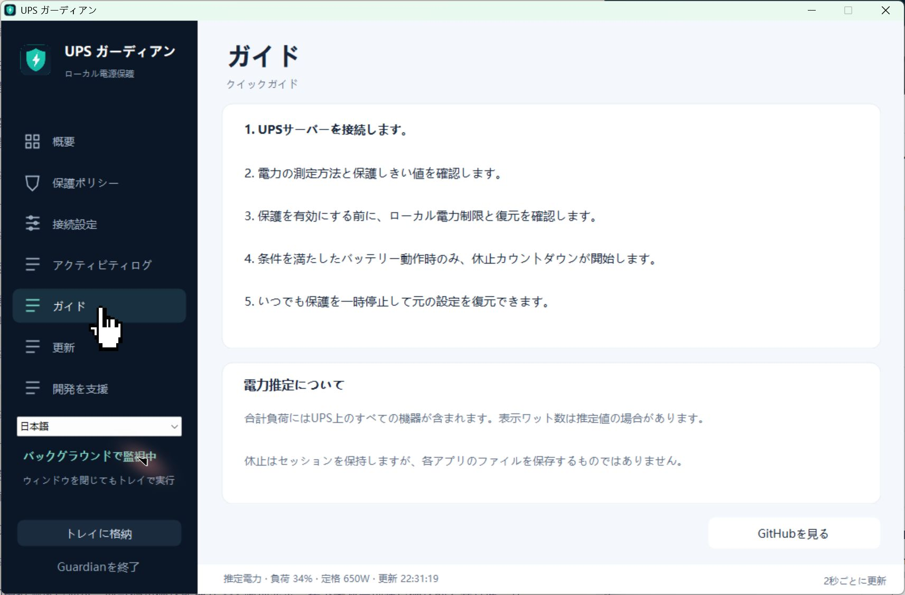

# UPS Guardian



A Windows tray application that monitors a Network UPS Tools (NUT) server, reduces local power demand when a configured load threshold is exceeded, and can hibernate on low battery conditions.

[简体中文](README.zh-CN.md) · [Releases](https://github.com/kylefu8/ups-guardian/releases) · [Changelog](CHANGELOG.md)

## Status

**Windows beta.** Monitoring and interface behavior have been checked on Windows 11 x64. Decision rules, restoration and updates have automated simulated tests. Hardware power changes and hibernation still need controlled validation on the user's own PC; simulated tests do not certify a UPS, graphics driver or power policy.

macOS is planned for a later phase. This release does not include a macOS application or claim that Windows GPU limits and hibernation work on a Mac.

## Features



- LAN NUT discovery with explicit selection of one readable UPS before read-only monitoring of load, battery charge, runtime and supply status.
- Live load chart, tray operation, event history and configurable protection rules.
- Reversible Windows processor limits and supported NVIDIA GPU power limits; CPU-only reduction is available.
- Battery-only hibernation rules with confirmation time, a visible countdown and cancellation when conditions clear.
- Simplified Chinese, English, Japanese, Korean, French, German and Spanish interface resources.
- Detailed in-app guide in all seven languages, with Guide, Updates and Support accessible directly from the sidebar.
- Compact language menu with a system-language option and a persistent sidebar version that links to Updates.
- Optional, voluntary donation page using maintainer-provided images.

## Requirements

- Windows 11 x64 with .NET Framework 4.8. Windows 10 has not yet been validated.
- A NUT server that permits read-only `LIST UPS` and `LIST VAR` queries from this PC, usually on TCP port 3493.
- Administrator rights for the current combined automatic-protection switch and highest-privilege logon task.
- NVIDIA power control requires a compatible driver and `nvidia-smi.exe`. Actual supported limits are detected; missing GPU control does not prevent UPS monitoring.

## Quick start

1. Download the Windows ZIP from Releases, extract it to a writable folder and run `UPSGuardian.exe`. Keep `UPSGuardian.Updater.exe` beside it.
2. In **Connection**, search the LAN, select one UPS and explicitly confirm the selection. Monitoring and protection remain unavailable until a readable target is confirmed. The scan port defaults to 3493 and can be changed; allow this PC in the NUT server's client list if access is denied.
3. In **Protection**, confirm the load measurement and thresholds. New profiles default to load percentage, not an assumed watt rating.
4. Review the detected power capabilities and perform controlled limit/restoration testing. Reopen with administrator privileges and explicitly enable protection when ready.
5. Closing the window hides it to the tray. Use **Pause and restore** to stop automatic actions, or **Exit** to restore owned limits and quit.

Confirmation starts read-only monitoring. The selected target is remembered and revalidated on startup; failure returns to discovery without switching to another UPS. Protection always requires manual activation after startup. Existing endpoints and protection parameters are preserved, but legacy profiles need an initial discovery confirmation. No personal UPS address, settings or logs are included in release archives.

Discovery prioritizes active Ethernet/Wi-Fi IPv4 interfaces with gateways, falling back to other active Ethernet/Wi-Fi interfaces only when none has a gateway. Larger networks are restricted to the local `/24`; scans are capped at 1024 addresses, 16 concurrent probes and a 30-second overall deadline, and can be canceled. The UI shows the scope. IPv6 and discovery across routed subnets are not supported yet.

## Protection behavior

- High load must persist for 5 seconds before reduction. Recovery requires the load to remain below the threshold minus the recovery margin for 30 seconds.
- A GPU target of `0` means CPU-only reduction. A positive target must fit the detected GPU's limits. An existing stricter cap is never raised.
- Battery rules apply **only while the UPS reports battery operation**. Defaults are charge below 50% **or** runtime below 180 seconds, followed by a 5-second confirmation and a 20-second countdown.
- Returning to mains, clearing the low-battery condition, stale data or pausing protection cancels the countdown.
- Hibernation preserves a Windows session; it does not save every application's files or guarantee that GPU/training jobs can resume. Those applications may need their own checkpoints.
- Missing or stale telemetry is unknown, not zero. Existing limits are retained while new actions are paused.

UPS load includes every device attached to the UPS. When actual watts are unavailable, estimated watts require both load percentage and a reported nominal watt rating. No fixed 650W rating is assumed for other UPS models.

## Updates and local data

Open **Updates** in the sidebar to check GitHub and choose **Download and install**. Installation requires automatic protection to be paused and any owned limits restored. The helper waits for the main application to exit, verifies the package again, replaces only allowed release files, rolls back on failure and restarts the application. It does not replace `data/`. The separate **Support** sidebar page contains the optional donation codes.

The current version and release channel are defined in `version.json`. Beta versions can discover compatible prereleases; stable versions ignore prereleases. Downloads use HTTPS and a published SHA-256 checksum. The beta does not yet provide code signing or notarization.

`data/` contains this installation's settings, language preference, events and any outstanding power-recovery record. Keep an outstanding `recovery.xml` until the application has restored its owned settings. Do not include `data/` in a release or source contribution.

## Build and test

On Windows with PowerShell and the .NET Framework compiler:

```powershell
.\build.ps1
.\test.ps1
.\package.ps1
```

Build output goes to `artifacts/windows-x64`; ZIP and checksums go to `artifacts/release`. Tests use simulated UPS servers, fake power backends and sandbox directories. They do not intentionally change system power limits or invoke sleep.

The portable core can also be compiled with a current .NET SDK:

```sh
dotnet build source/Core/UpsGuardian.Core.csproj
```

See [platform boundaries](docs/architecture.md) and [release procedure](docs/releasing.md). The editable icon and its renderer are included. Donation images are optional build inputs and are deliberately excluded from Git; see [donation resources](assets/donations/README.md).

## License

MIT. See [LICENSE](LICENSE).
